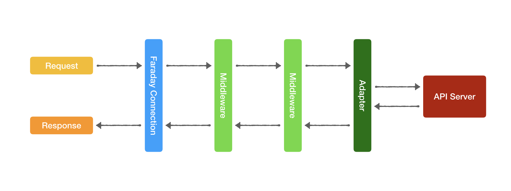

A `Faraday::Connection` uses a `Faraday::RackBuilder` to assemble a
Rack-inspired middleware stack for making HTTP requests. Each middleware runs
and passes an Env object around to the next one. After the final middleware has
run, Faraday will return a `Faraday::Response` to the end user.



The order in which middleware is stacked is important. Like with Rack, the
first middleware on the list wraps all others, while the last middleware is the
innermost one, so that must be the adapter.

```ruby
Faraday.new(...) do |conn|
  # POST/PUT params encoders:
  conn.request :multipart
  conn.request :url_encoded

  # Last middleware must be the adapter:
  conn.adapter :net_http
end
```

This request middleware setup affects POST/PUT requests in the following way:

1. `Request::Multipart` checks for files in the payload, otherwise leaves
  everything untouched;
2. `Request::UrlEncoded` encodes as "application/x-www-form-urlencoded" if not
  already encoded or of another type

Swapping middleware means giving the other priority. Specifying the
"Content-Type" for the request is explicitly stating which middleware should
process it.

Examples:

```ruby
# uploading a file:
payload[:profile_pic] = Faraday::FilePart.new('/path/to/avatar.jpg', 'image/jpeg')

# "Multipart" middleware detects files and encodes with "multipart/form-data":
conn.put '/profile', payload
```
